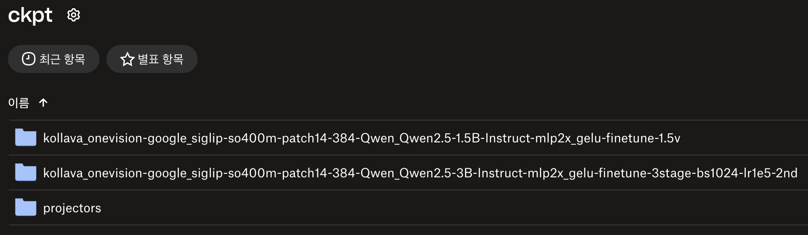

# KOVA (Korean-Optimized Vision Assistant)


https://github.com/user-attachments/assets/fd5353a4-1b1e-48df-a5df-391f4437b60e


### STEP 1. make .env file
```
GROQ_API_KEY=<YOUR API KEY>
SK_OPEN_API_KEY=<YOUR API KEY>
```
You can manage your API keys here: https://console.groq.com/playground , https://openapi.sk.com/mypage/dashboard

### STEP 2-0. install tkinter (if needed)
```shell
python3 -m tkinter
```
if nothing pops up with above command, then install tkinter
```shell
brew install tcl-tk
echo 'export PATH="/usr/local/opt/tcl-tk/bin:$PATH"' >> ~/.zshrc
echo 'export LDFLAGS="-L/usr/local/opt/tcl-tk/lib"' >> ~/.zshrc
echo 'export CPPFLAGS="-I/usr/local/opt/tcl-tk/include"' >> ~/.zshrc
source ~/.zshrc
```

### STEP 2-1. install dependencies
```
python3.12 -m venv .venv
source .venv/bin/activate
brew install portaudio
pip install -r requirements-mac.txt
```
mac
```
python3.12 -m venv .venv
.venv\Scripts\activate
pip install -r requirements-windows.txt
pip install torch torchvision torchaudio --index-url https://download.pytorch.org/whl/cu124
```
windows

### STEP 2-2. download pretrained model
```shell
chmod +x download_models.sh
./download_models.sh
```
download pre-trained segmentation from hugging-face


### STEP 2-3. install pre-commit before commit
```shell
pre-commit install
pre-commit run --all-files # if you want to check all files
```


### STEP 2-4. download pre-trained ckpt of KoLLava-OneVision


KoLLava-OneVision의 사전 훈련된 체크포인트는 Dropbox에 업로드되어 있습니다.


### STEP 3. run end-to-end voice assistant
```shell
python llm_tts.py
python llm_tts_with_wakeup.py
```

- 첫번째 스크립트는 "ask" 버튼을 통해 음성으로 인풋을 줄 수 있습니다.
- 두번째 스크립트는 "hi KOVA" 이라는 hotword를 인식해 음성 입력을 시작할 수 있습니다.

[update]

- [x] wake up trigger ('hi KOVA')
- [x] 챗봇 답변 도중 interrupt 가능
- [x] 클립보드의 텍스트 or 이미지 함께 제공 가능
- [x] GUI Effect
- [x] VLM 로컬 모델로 포팅

[todo]

- [ ] LLM 및 TTS 로컬 모델로 포팅
- [ ] KoLLaVA-OneVision 추가 학습
- [ ] wakeup trigger 인식률 개선
